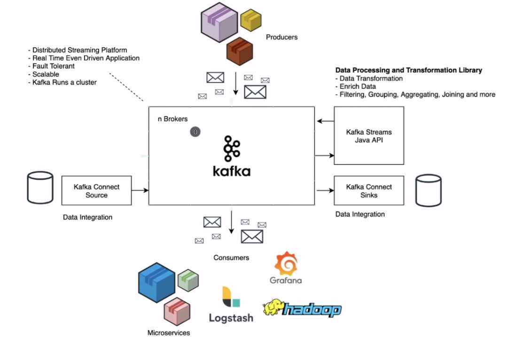
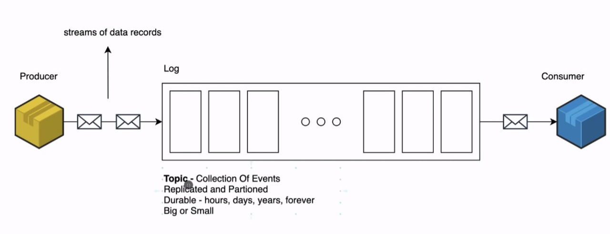
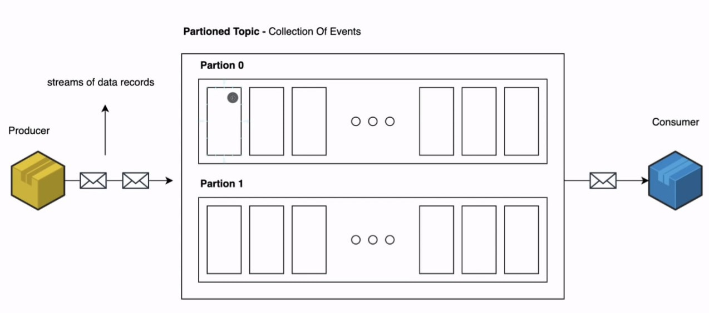
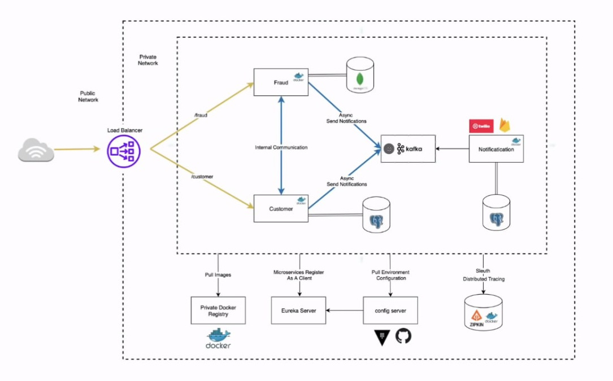

## Simple sub/pub application using apache kafka and spring boot


### What is Apache Kafka?

Apache Kafka is a distributed data store optimized for ingesting and processing streaming data in real-time. Streaming data is data that is continuously generated by thousands of data sources, which typically send the data records in simultaneously. A streaming platform needs to handle this constant influx of data, and process the data sequentially and incrementally.

Kafka provides three main functions to its users:

* Publish and subscribe to streams of records
* Effectively store streams of records in the order in which records were generated
* Process streams of records in real time

Kafka is primarily used to build real-time streaming data pipelines and applications that adapt to the data streams. It combines messaging, storage, and stream processing to allow storage and analysis of both historical and real-time data. 

### Configuration

The configuration can easily be setup with the Bitnami Apache Kafka Docker image using the following environment variables:

* `ALLOW_PLAINTEXT_LISTENER`: Allow to use the PLAINTEXT listener. Default: **no**.
* `KAFKA_INTER_BROKER_USER`: Apache Kafka inter broker communication user. Default: admin. Default: **user**.
* `KAFKA_INTER_BROKER_PASSWORD`: Apache Kafka inter broker communication password. Default: **bitnami**.
* `KAFKA_CERTIFICATE_PASSWORD`: Password for certificates. No defaults.
* `KAFKA_HEAP_OPTS`: Apache Kafka's Java Heap size. Default: **-Xmx1024m -Xms1024m**.
* `KAFKA_ZOOKEEPER_PROTOCOL`: Authentication protocol for Zookeeper connections. Allowed protocols: **PLAINTEXT**, **SASL**, **SSL**, and **SASL_SSL**. Defaults: **PLAINTEXT**.
* `KAFKA_ZOOKEEPER_USER`: Apache Kafka Zookeeper user for SASL authentication. No defaults.
* `KAFKA_ZOOKEEPER_PASSWORD`: Apache Kafka Zookeeper user password for SASL authentication. No defaults.
* `KAFKA_ZOOKEEPER_TLS_KEYSTORE_PASSWORD`: Apache Kafka Zookeeper keystore file password and key password. No defaults.
* `KAFKA_ZOOKEEPER_TLS_TRUSTSTORE_PASSWORD`: Apache Kafka Zookeeper truststore file password. No defaults.
* `KAFKA_ZOOKEEPER_TLS_VERIFY_HOSTNAME`: Verify Zookeeper hostname on TLS certificates. Defaults: **true**.
* `KAFKA_ZOOKEEPER_TLS_TYPE`: Choose the TLS certificate format to use. Allowed values: `JKS`, `PEM`. Defaults: **JKS**.
* `KAFKA_CFG_SASL_ENABLED_MECHANISMS`: Allowed mechanism when using SASL either for clients, inter broker, or zookeeper comunications. Allowed values: `PLAIN`, `SCRAM-SHA-256`, `SCRAM-SHA-512` or a comma separated combination of those values. Default: **PLAIN,SCRAM-SHA-256,SCRAM-SHA-512**
* `KAFKA_CFG_SASL_MECHANISM_INTER_BROKER_PROTOCOL`: SASL mechanism to use for inter broker communications. No defaults.
* `KAFKA_TLS_CLIENT_AUTH`: Configures kafka brokers to request client authentication. Allowed values: `required`, `requested`, `none`. Defaults: **required**.
* `KAFKA_TLS_TYPE`: Choose the TLS certificate format to use. Allowed values: `JKS`, `PEM`. Defaults: **JKS**.
* `KAFKA_CLIENT_USERS`: Users that will be created into Zookeeper when using SASL for client communications. Separated by commas. Default: **user**
* `KAFKA_CLIENT_PASSWORDS`: Passwords for the users specified at`KAFKA_CLIENT_USERS`. Separated by commas. Default: **bitnami**
* `KAFKA_CFG_MAX_PARTITION_FETCH_BYTES`:  The maximum amount of data per-partition the server will return. Default: **1048576**
* `KAFKA_CFG_MAX_REQUEST_SIZE`: The maximum size of a request in bytes. Default: **1048576**
* `KAFKA_ENABLE_KRAFT`: Whether to enable Kafka Raft (KRaft) mode. Default: **no**
* `KAFKA_KRAFT_CLUSTER_ID`: Kafka cluster ID when using Kafka Raft (KRaft). No defaults.

Additionally, any environment variable beginning with `KAFKA_CFG_` will be mapped to its corresponding Apache Kafka key. For example, use `KAFKA_CFG_BACKGROUND_THREADS` in order to set `background.threads` or `KAFKA_CFG_AUTO_CREATE_TOPICS_ENABLE` in order to configure `auto.create.topics.enable`.

```console
$ docker run --name kafka -e KAFKA_CFG_ZOOKEEPER_CONNECT=zookeeper:2181 -e ALLOW_PLAINTEXT_LISTENER=yes -e KAFKA_CFG_AUTO_CREATE_TOPICS_ENABLE=true bitnami/kafka:latest
```

or by modifying the [`docker-compose.yml`](https://github.com/bitnami/bitnami-docker-kafka/blob/master/docker-compose.yml) file present in this repository:

```yaml
kafka:
  ...
  environment:
    - KAFKA_CFG_ZOOKEEPER_CONNECT=zookeeper:2181
  ...
```

### Run docker containers for kafka and zookeeper.
```yaml
services:
  zookeeper:
    image: 'bitnami/zookeeper:latest'
    ports:
      - '2181:2181'
    environment:
      - ALLOW_ANONYMOUS_LOGIN=yes
  kafka:
    image: 'bitnami/kafka:latest'
    ports:
      - '9092:9092'
    environment:
      - KAFKA_BROKER_ID=1
      - KAFKA_CFG_LISTENERS=PLAINTEXT://:9092
      - KAFKA_CFG_ADVERTISED_LISTENERS=PLAINTEXT://127.0.0.1:9092
      - KAFKA_CFG_ZOOKEEPER_CONNECT=zookeeper:2181
      - ALLOW_PLAINTEXT_LISTENER=yes
    depends_on:
      - zookeeper
```

To deploy it, run the following command in the directory where the `docker-compose.yml` file is located:

```
docker-compose up -d
```
### How does Kafka work?








